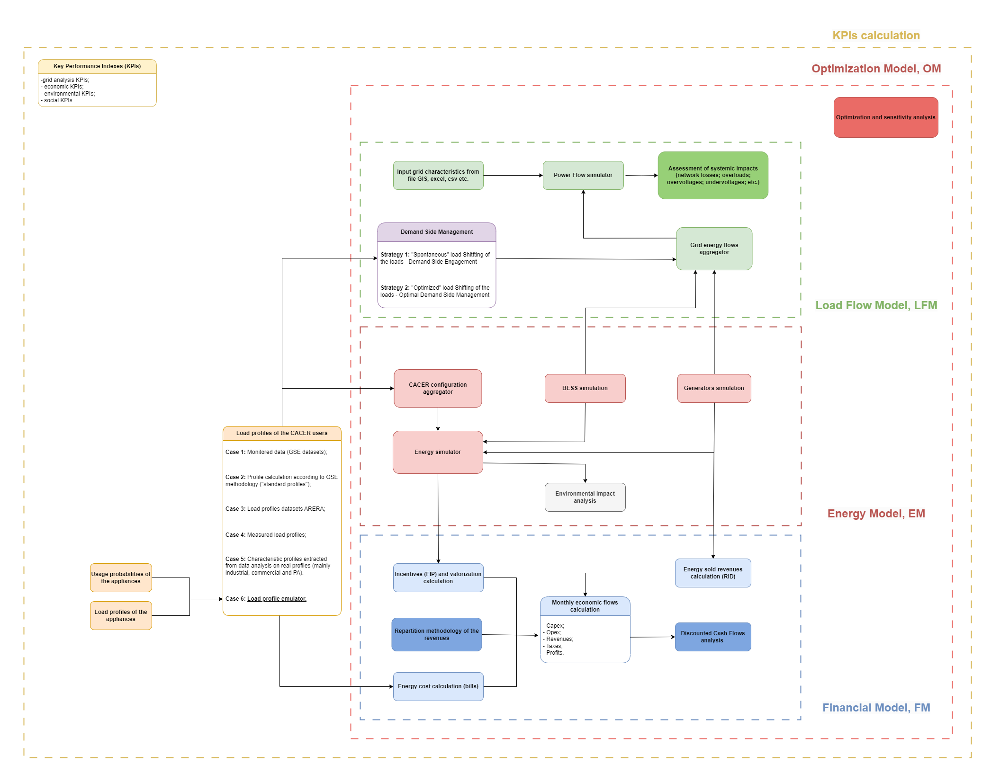

---

# CACER Simulator

This repository contains a simulation tool for assessing the **economic**, **financial**, and **energy** performance of renewable energy sharing configurations such as CACER (Configurations for Renewable Energy Sharing in Collective Self-Consumption).

## Description

The simulator supports the evaluation of different collective self-consumption scenarios, including Renewable Energy Communities (RECs) and Groups of Remote Self-Consumers. It provides detailed metrics such as:

- **Economic benefits**: savings and revenues from self-consumed and exported energy.
- **Financial indicators**: Payback Period, Net Present Value (NPV), and Internal Rate of Return (IRR).
- **Energy performance**: self-consumption levels, self-sufficiency, and CO₂ emissions reduction.

## Flow chart CACER simulator

<div style="text-align: center;">
  
</div>

## Repository Structure

- `assets/`: contains visual outputs or auxiliary resources.
- `files/`: input/output files and configuration data for simulations.
- `Funzioni_Demand_Side_Management.py`: functions for emulating the residential load profile and for simulating demand-side flexibility and management.
- `Funzioni_Energy_Model.py`: core energy modeling functions for CACER simulations (photovoltaic productivity simulation, load profile extraction, etc.).
- `Funzioni_Financial_Model.py`: functions for financial analysis and investment evaluation (Discounted Cash Flow analysis).
- `Funzioni_Generali.py`: general-purpose utility functions used throughout the project.
- `config.yml`: configuration file with key parameters for the simulations and path of file and forlders.
- `main - CACER tutorial.ipynb`: interactive Jupyter Notebook with step-by-step instructions for using the CACER simulator.
- `reporting_v3.ipynb`: notebook to generate performance reports.
- `users CACER.xlsx`: example Excel file with user data.

## Prerequisites

You’ll need:

- Python 3.x
- Required libraries listed in `requirements.txt`

## Installation

1. Clone the repository:

   ```bash
   git clone https://github.com/ToniRollo/CACER-simulator.git

---

## 🔥 **New drop incoming!!**

## Main Functionalities

`🚨 PAY ATTENTION: ALL THE FOLLOWING FUNCTIONALITIES ARE ALREADY DEVELOPED IN THIS REPOSITORY AND HOW IT WORKS WILL BE EXPLAINED IN DETAIL LATER IN THIS SECTION `

### 1. Photovoltaic Productivity Simulator

`work in progress...`

`🚀 A tutorial main will be released later for this module!`

### 2. BESS Simulator

`work in progress...`

### 3. Load Profile Domestic Users Emulator

`work in progress...`

`🚀 A tutorial main will be released later for this module!`

#### 3.1. Demand Side Engagement Simulator

`work in progress...`

#### 3.2. Optimal Demand Side Management Simulator

`work in progress...`

### 4. Bills Simulator

`work in progress...`

### 5. Discounted Cash Flow Simulator

`work in progress...`

#### 5.1. Funding Scheme 

`work in progress...`

#### 5.2. Incentives Repartition Methodology

`work in progress...`

### 6. Grid Impact Simulator

`work in progress...`

`🚀 A tutorial main will be released later for this module!`
